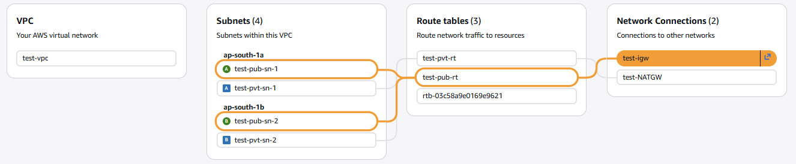

# Private EKS Cluster with OpenVPN Access Server

## Overview
This project demonstrates how to set up a **private Amazon EKS cluster** with a **custom VPC** and enable secure access via **OpenVPN Access Server**.  
It includes VPC configuration, subnet routing, EC2 setup for VPN, and connectivity testing to private EKS endpoints.

---

## Architecture

- **VPC:** 1 custom VPC  
- **Subnets:** 2 public, 2 private  
- **Route Tables:** 1 public RT, 1 private RT  
- **Internet Gateway:** 1  
- **NAT Gateway:** 1  
- **Security Groups:** for VPN server (SSH, HTTPS, OpenVPN TCP/UDP)  
- **EC2:** Ubuntu instance in public subnet running OpenVPN AS  
- **EKS:** Private cluster with private API endpoint accessible via VPN  

## Flow
[Internet] --> [IGW] --> [Public Subnet: OpenVPN EC2] --> [Private Subnet: EKS Nodes]

---

## Prerequisites

- AWS account with VPC, EC2, and EKS access  
- Basic Linux knowledge  
- OpenVPN Access Server installation credentials (optional: official OpenVPN docs)

---

## Step 1: Create VPC and Subnets

1. Create a custom VPC.  
2. Add 2 public subnets and 2 private subnets.  
3. Attach:
   - Public route table → Internet Gateway  
   - Private route table → NAT Gateway  


---

## Step 2: Create Security Group for OpenVPN Server

Allow the following inbound rules:  

| Protocol | Port | Source |
|----------|------|--------|
| SSH      | 22   | Anywhere (or restricted IP) |
| HTTPS    | 443  | Anywhere |
| TCP      | 943  | Anywhere |
| TCP      | 945  | Anywhere |
| UDP      | 1194 | Anywhere |

---

## Step 3: Launch EC2 for OpenVPN AS

1. Launch an Ubuntu EC2 instance in a public subnet.  
2. Enable **public IP** and attach the OpenVPN SG.  
3. Connect via SSH and switch to root:
```bash
sudo -i
```
### Install OpenVPN Access Server:
```bash
bash <(curl -fsS https://packages.openvpn.net/as/install.sh) --yes
```

Access Server UIs:
Admin UI: https://<OPENVPN_PUBLIC_IP>:943/admin
Client UI: https://<OPENVPN_PUBLIC_IP>:943/
Use the default credentials initially (change after login).

---

## Step 4: Configure EKS Private Cluster
1. Create a private EKS cluster.
2. Add inbound rule to the cluster security group:
HTTPS (443)
Source: OpenVPN EC2 security group

---

## Step 5: Configure OpenVPN Routing
SSH into OpenVPN server and run:
```bash
# Route VPN clients to your VPC CIDR
sudo /usr/local/openvpn_as/scripts/sacli --key "vpn.server.routing.private_network.0" --value "<VPC_CIDR>" ConfigPut

# Route only VPC traffic through VPN
sudo /usr/local/openvpn_as/scripts/sacli --key "vpn.client.routing.reroute_gw" --value "false" ConfigPut

# Apply changes
sudo /usr/local/openvpn_as/scripts/sacli start

# Verify settings
sudo /usr/local/openvpn_as/scripts/sacli ConfigQuery | grep "vpn.server.routing"
```

for example 
```
# Add your VPC CIDR (10.0.0.0/16) to routing
sudo /usr/local/openvpn_as/scripts/sacli --key "vpn.server.routing.private_network.0" --value "10.0.0.0/16" ConfigPut

# Don't route all internet traffic through VPN (only route VPC traffic)
sudo /usr/local/openvpn_as/scripts/sacli --key "vpn.client.routing.reroute_gw" --value "false" ConfigPut

# Apply changes and restart OpenVPN
sudo /usr/local/openvpn_as/scripts/sacli start

# Verify the settings were applied
sudo /usr/local/openvpn_as/scripts/sacli ConfigQuery | grep "vpn.server.routing"
```
Expected output: ```"vpn.server.routing.private_network.0": "10.0.0.0/16" ```

## Step 6: Test VPN Connectivity
- Windows:
route print | findstr <VPC_CIDR>
eg: ``` bashroute print | findstr 10.0 ```

- Ping private EKS nodes:
``` ping <EKS_PRIVATE_IP> ```


